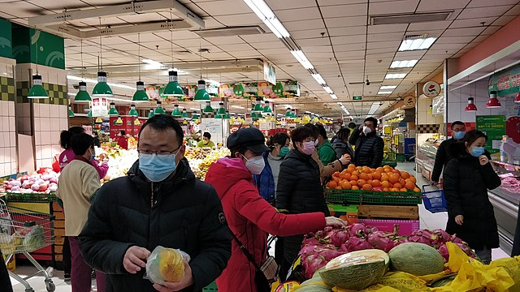
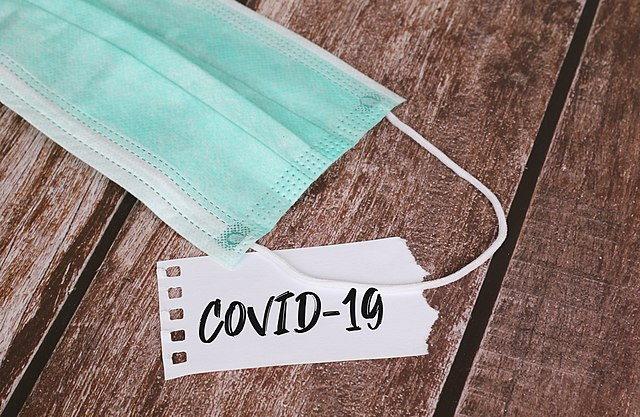
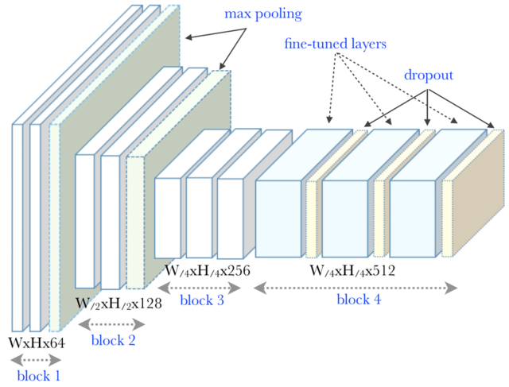
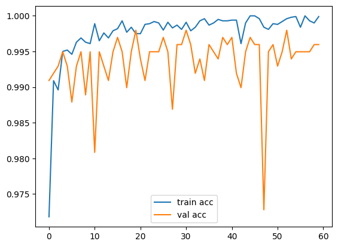
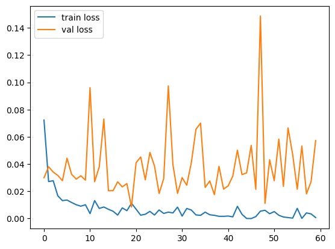
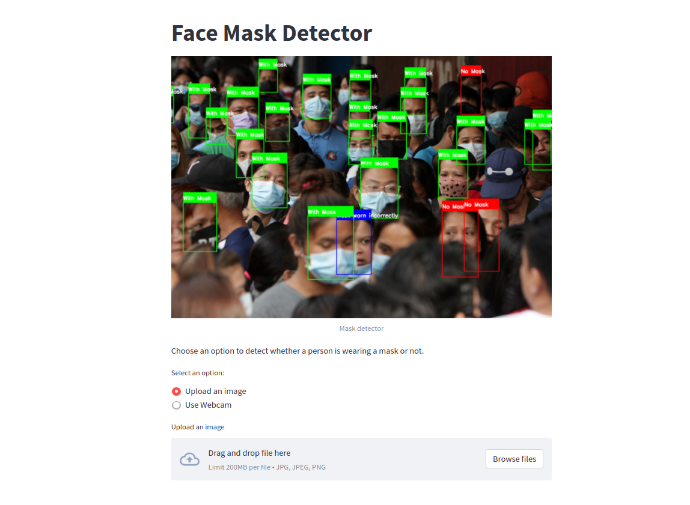

# Face Mask Detection Challenge - VGG16 

## Introduction

After catching covid-19 in during the pandemic, I was motivated to come up with a comprehensive Face mask detection model that used Deep Learning to predict whether someone in a live video is wearing a mask or not. I will use a Large scale PTM : VGG16 

## Dataset

Dataset Source [Face Mask ~12K Images Dataset](https://www.kaggle.com/ashishjangra27/face-mask-12k-images-dataset).

## VGG16 architecture
This model uses the pretrained model which has an architecture as below 

## Accuracy & Loss evaluation 

## Installation
* Unzip the `Mask_detection.zip`
* Run `pipenv shell`
* Run `streamlit run app.py`
* The Model's website should open in a new Browser window 

